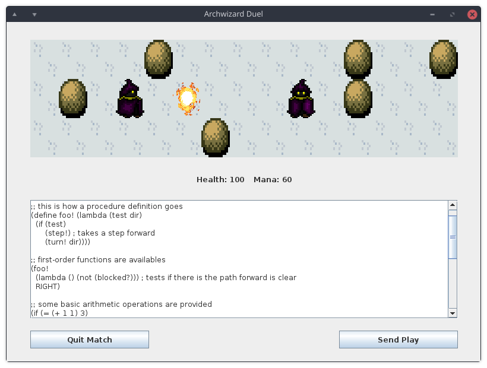

# Archwizard Duel

O [projeto da disciplina INE5417](https://www.inf.ufsc.br/~ricardo.silva/INE5417e5608/) (Engenharia de Software I) consiste em um jogo multijogador distribuído desenvolvido em Java através de modelagem orientada a objetos em UML 2 e utilizando a biblioteca [NetGamesNRT](http://www.labsoft.ufsc.br/~netgames/NetGamesNRT).

**Utilizado como desculpa para produzir um software extensível via linguagem de *scripting* com interpretador próprio.**

## Sobre

Em **Archwizard Duel**, cada jogador tem ao seu controle um mago com o qual deve provar seu valor ao vencer **duelos PvP**.
O combate acontece **em turnos**, cada um consistindo na simulação de um intervalo de tempo em uma arena.
As ações dos magos são **programadas por código** escrito pelos jogadores em uma linguagem específica.

Jogos com ideias semelhantes e seus respectivos estilos de controles programáticos:

- [Gladiabots](https://store.steampowered.com/app/871930/Gladiabots/) (2019) - Fluxogramas
- [Robocode](http://robowiki.net/wiki/Robocode) (2001) - Java
- [Crobots](http://crobots.deepthought.it/home.php) (1985) - C
- [RobotWar](https://en.wikipedia.org/wiki/RobotWar) (1981) - BASIC
- [Color Robot Battle](https://programminggames.org/Color_Robot_Battle) (1981) - Assembly

Implementaremos uma pequena linguagem Lisp, isso facilitará parsing e interpretação.
Referências na literatura:

- [Circular Evaluator - Abelson & Sussman, Structure and Interpretation of Computer Programs](https://mitpress.mit.edu/sites/default/files/sicp/full-text/book/book-Z-H-26.html)
- [Bytecode Pattern - Nystrom, Game Programming Patterns](http://gameprogrammingpatterns.com/bytecode.html)

## Desenvolvimento

### [Tarefas](https://github.com/baioc/ArchwizardDuel/projects)

- [Geral](https://github.com/baioc/ArchwizardDuel/projects/4)
- [Rede](https://github.com/baioc/ArchwizardDuel/projects/1)
- [Engine](https://github.com/baioc/ArchwizardDuel/projects/2)
- [Interpretador](https://github.com/baioc/ArchwizardDuel/projects/3)

### [Documentação](doc/)

- [Especificação de Requisitos](doc/Requisitos.pdf)
- [Guia para *workflow* com Git](doc/git-style.md)
- [Padrões de estilo de código Java](doc/coding-style.md)
