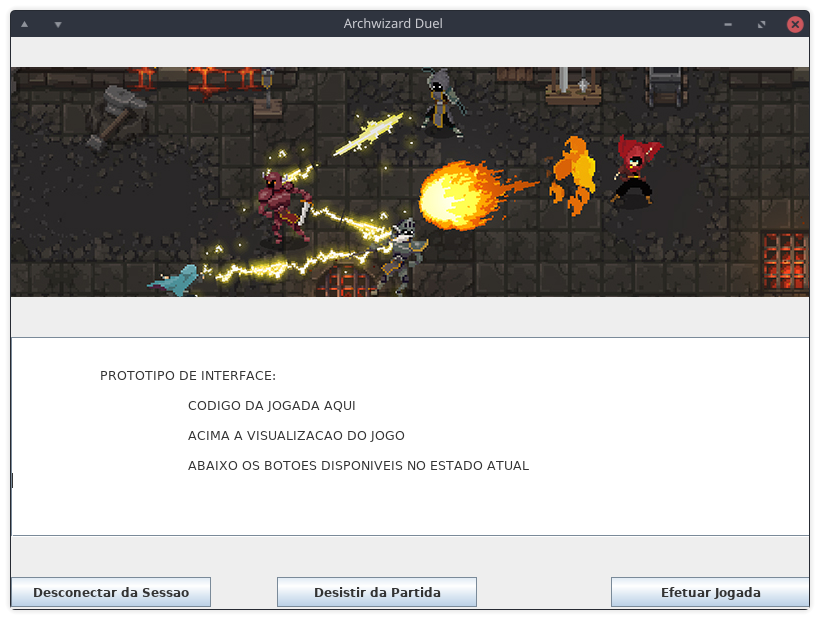

# Especificação de Requisitos

## Projeto Archwizard Duel

### Especificação de Requisitos de Software

| Versão | Autores | Data | Ação |
| :---: | :--- | :--- | :--- |
| 0.1 | Alek Frohlich, Gabriel B. Sant'Anna e Mateus Favarin | 10/09/2019 | Eliciação |
| 0.2 | Alek Frohlich, Gabriel B. Sant'Anna e Mateus Favarin | 15/09/2019 | Atualização da descrição do jogo e dos requisitos não funcionais |

## Introdução

Em **Archwizard Duel**, cada jogador tem ao seu controle um mago com o qual deve provar seu valor ao vencer **duelos** contra seus oponentes.
O combate acontece **em turnos**, cada um consistindo na simulação de um intervalo de tempo em uma arena.
As ações dos magos são **programadas por código** escrito pelos jogadores em uma linguagem específica.

### Objetivos

Desenvolver um **jogo *Player vs Player*** (PVP) utilizando a ferramenta de jogos distribuídos **NetGames**.
Este será entregue como [trabalho da disciplina **INE5417**](https://www.inf.ufsc.br/~ricardo.silva/INE5417e5608/) (Engenharia de Software I).

### Descrição do Jogo

- Uma partida consiste em uma arena com dois magos - cada um controlado por um jogador - os quais se alternam em turnos para lançar feitiços e se movimentar até que algum jogador vença.
- Cada ação de um mago gasta parte de um recurso seu chamado mana.
- Um turno consiste em uma sequência de ações efetuadas até que acabe a mana do mago controlado pelo jogador atuante (da vez), momento em que passa a ser o turno do outro jogador, e assim por diante.
- Cada mago possui também um atributo de vida, que é reduzida quando ele é atingido por um feitço inimigo.
- Uma partida termina quando a vida de um dos magos acaba, caracterizando vitória do jogador que controla o outro mago (que ainda tem vida).
- As ações realizadas pelos magos são controlados pelos seus respectivos jogadores através de jogadas.
- Uma jogada consiste em um código (texto) em uma linguagem de programação específica do jogo que define as ações a serem realizadas naquele turno (até que acabe a mana).
- Ações são, portanto, operações primitivas dessa linguagem que alteram o estado do jogo; `fireball` (para lançar um feitiço) e `move` (para movimentar o mago) são possíveis exemplos de tais operações.
- Essas primitivas, juntamente com [estruturas de controle](https://en.wikiversity.org/wiki/Control_structures) e [funções de primeira classe](https://en.wikipedia.org/wiki/First-class_function) (`if-then-else`, `for`, `define`, etc) compõe a linguagem de programação que serve de controle aos jogadores.
- A cada turno, o jogador deve escrever uma sequência de expressões válidas na linguagem, a qual será interpretada pelo programa - da mesma forma para ambos os jogadores - de maneira a trazer ao estado do jogo as alterações descritas nessa jogada.

### Referências

Jogos com ideias semelhantes e seus respectivos estilos de controles programáticos:

- [Gladiabots](https://store.steampowered.com/app/871930/Gladiabots/) (2019) - Programação visual através de fluxogramas.
- [Robocode](http://robowiki.net/wiki/Robocode) (2001) - Programação em código, semelhante a Java.
- [Crobots](http://crobots.deepthought.it/home.php) (1985) - Programação em código, semelhante a C.
- [RobotWar](https://en.wikipedia.org/wiki/RobotWar) (1981) - Programação em código, semelhante a BASIC.
- [Color Robot Battle](https://programminggames.org/Color_Robot_Battle) (1981) - Programação em código, semelhante a Assembly.

## Visão Geral

### Arquitetura do Programa

Programa **orientado a objetos**, **distribuído** e **multiusuário** (dois jogadores).

### Premissas de Desenvolvimento

- A implementação deverá ser na linguagem Java.
  - Deve ser compatível com o [Java Runtime Environment (JRE) versão 8](https://java.com/en/download/).
- Deve utilizar o framework [NetGamesNRT](http://www.labsoft.ufsc.br/~netgames/NetGamesNRT/) para execução distribuída.
- Deverá ser entregue a modelagem do software em UML 2 produzida com a ferramenta [Visual Paradigm](https://www.visual-paradigm.com/) (*Community Edition*)
- O programa deve apresentar uma interface gráfica bidimensional.

### Interface Gráfica

Segue abaixo um rascunho da interface gráfica que poderia ser apresentada pelo cliente do jogo.

Destaca-se, entretanto, que são mostrados apenas elementos (botões) referentes ao estado de uma partida em andamento.
Estes seriam substituídos por opções como "Conectar" e "Criar Sessão" ou "Iniciar Partida" e "Desconectar" dependendo do momento atual da interação do usuário com o programa (se está ou não conectado a uma sessão juntamente com outro usuário remoto, por exemplo).

## Requisitos de Software

### Requisitos Funcionais

- **Criar sessão:**
  O programa deve fornecer em sua interface a opção de estabelecer uma sessão de jogo para que outros usuários possam se conectar.

- **Conectar à sessão:**
  O programa deverá estabelecer a conexão entre os dois jogadores através do servidor NetGames.
  Cada jogador deve se identificar com um nome para seu personagem.

- **Iniciar partida:**
  O programa deve conter um botão que inicia a partida (caso já não exista alguma em andamento).

- **Receber determinação de início de partida:**
  O programa deve avisar ao usuário que a partida foi iniciada.

- **Entrada de código:**
  O programa deve disponibilizar uma caixa de texto onde o jogador poderá digitar o código que servirá como esquema de controle do seu personagem em uma partida.

- **Enviar jogada:**
  O programa deverá conter um botão que finaliza a jogada atual, enviando o código a um interpretador que realiza o controle do personagem na partida em andamento.

- **Receber jogada:**
  O programa deverá mostrar as jogadas realizadas pelo jogador remoto, atualizando o cliente do usuário local.

- **Desistir da partida:**
  O programa deve conter um botão para abandonar uma partida em andamento.

- **Desconectar da sessão:**
  O programa poderá desligar a conexão entre os jogadores caso estes não desejem iniciar novas partidas.

### Requisitos Não Funcionais

- **Especificações de projeto:**
  O programa deverá ser escrito em Java, deverá ser compilado de forma a ser compatível com a JRE de versão 8 e deve seguir uma modelagem UML2
  conformante com a metodologia vista em aula.

- **Framework distribuído:**
  O programa deve utilizar o framework NetGamesNRT para realizar a comunicação cliente-servidor.

- **Interface gráfica:**
  O programa deve possuir uma interface gráfica que represente o estado compartilhado do jogo.
  Esta interface será implementada em Java Swing por questões de compatibilidade.

- **Características da linguagem:**
  A linguagem do jogo deverá tomará uma forma semelhante à de [Lisp](https://en.wikipedia.org/wiki/LISP). Devendo prover primitivas para controlar o personagem (movimento, feitiços) e definir o fluxo de execução de suas ações (desvios condicionais, procedimentos).
